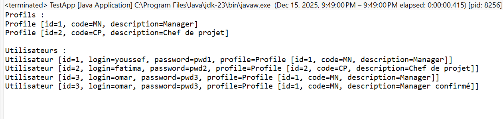

# CRUD Complet avec DAO Générique en Java

### Objectifs

L’objectif de cet exercice est de concevoir et implémenter une application Java structurée selon une architecture en couches, permettant la gestion complète des opérations CRUD.  
Il vise à renforcer la compréhension de la programmation orientée objet, de la généricité, ainsi que de la séparation des responsabilités entre les différentes couches applicatives.

### Fonctionnalités

Gestion des entités métier Profile et Utilisateur avec identifiant auto-incrémenté.  
Implémentation d’un DAO générique offrant les opérations de création, lecture, mise à jour et suppression.  
Persistance des données en mémoire à l’aide d’une implémentation basée sur une liste dynamique.  
Encapsulation de la logique métier dans des services dédiés pour les profils et les utilisateurs.  
Recherche métier permettant de récupérer les utilisateurs associés à un profil donné.  
Exécution de scénarios CRUD complets via une application console centralisée.

### Utilisation

L’application est lancée à partir d’une classe principale jouant le rôle de couche de présentation.  
Les profils sont créés en premier, puis associés aux utilisateurs lors de leur création.  
Les services permettent ensuite d’afficher l’ensemble des données, de modifier certaines informations, de supprimer des éléments et d’exécuter des règles métier spécifiques.  
Le flux de traitement respecte strictement l’enchaînement Application → Service → DAO → Modèle, garantissant une architecture claire et maintenable.

### Résultats (Capture d’Écran)

